# ARCH-001 — SciGPU System Architecture

| Field | Value |
|---|---|
| Document ID | ARCH-001 |
| Title | SciGPU GPU System Architecture |
| Status | APPROVED — G0-ARCH BASELINE |
| Parent | SPEC-000 Rev 0.2 (APPROVED at G0-SPEC) |
| Children (future) | MICRO-001, SCHED-001, REG-001, FP-001, CACHE-001, NOC-001, CMD-001, ABI-001, DRV-001, RT-001, DEBUG-001, RAS-001 |
| Companion ADRs | ADR-001…ADR-010 |

## Revision History

| Rev | Date | Author | Description |
|---|---|---|---|
| 1.0 | 2026-08-23 | Principal GPU Architect | Initial complete architecture baseline for G0-ARCH |

---

## Table of Contents

1. Purpose and Authority
2. Architectural Context
3. Design Principles
4. Terminology (normative pointer)
5. Top-Level System Hierarchy
6. Front End: Host Interface, Command Processor, Queues, Dispatch
7. Global Dispatcher and Work Distribution
8. Compute Cluster
9. Compute Unit (CU) Architecture
10. Logical vs Physical Execution Width (normative execution-beat model)
11. Architectural State Inventory
12. Register Architecture (VGPR/SGPR subsystem)
13. Scalar/Vector Interaction Semantics
14. Execution Pipelines and Latency Contracts
15. Scheduling Hierarchy and Wavefront Scheduling
16. Load/Store Path and Coalescing
17. Memory Hierarchy
18. Shared Memory Architecture
19. L1 / L2 / Memory Fabric
20. Internal Memory Transport (vendor-neutral)
21. Memory Consistency Summary (normative model = MEM-001)
22. DMA and Host Data Path
23. Interrupt and Fault Architecture
24. Clock and Reset Architecture
25. Debug, Performance Monitoring, RAS
26. Security and Isolation Hooks
27. Parameterization Model (architectural vs microarchitectural)
28. Configuration Profiles
29. Floating-Point Resource Coexistence
30. Matrix Engine Integration
31. Occupancy Model and PERF-001 Hooks
32. Scalability Limits, Bottlenecks, Deadlock Analysis
33. Architecture Invariants (ARCH-INV-*)
34. Interface Tables
35. FPGA Mapping Strategy
36. ASIC Portability Considerations
37. Architecture Verification Obligations
38. Requirement Traceability Map
39. Open Items and Non-Blocking Studies
40. Self-Review Reference

---

## 1. Purpose and Authority

ARCH-001 defines the complete SciGPU system decomposition, block responsibilities, interface
contracts, execution semantics at architectural level, state inventory, invariants, and mapping
strategy. It is the parent of all microarchitecture documents and the authority for what exists
at system level. Where SPEC-000 says *what*, this document fixes *what is where and who talks to
whom*; exact cycle behavior belongs to MICRO-001-family documents.

Authority chain: SPEC-000 Rev 0.2 → ARCH-001 → derived microarchitecture documents → RTL.
RTL development remains unauthorized until G0-ARCH (SPEC §14.1).

Parent requirement traceability appears per section as `[SPEC GPU-*]` tags and collectively in
§38.

## 2. Architectural Context

```
        ┌────────────────────────────────────────────────────────────┐
        │ Host (x86 sim · Zynq US+ PS · PCIe host)                   │
        │   runtime libscigpu · driver · OS                          │
        └───────────────┬────────────────────────────────────────────┘
                        │ generic host interface (MMIO + queues + DMA)
                        │ [FPGA: AXI4-Lite ctrl / AXI4 mm / AXI4-Stream]
                        ▼
┌───────────────────────────────────────────────────────────────────────┐
│ SciGPU device                                                         │
│  ┌──────────────┐   ┌───────────────────────────────────────────┐     │
│  │ Host Iface   │──▶│ Command Processor (queues, dispatch)      │     │
│  │ regs/IRQ     │   └───────────────┬───────────────────────────┘     │
│  └──────┬───────┘                   ▼                                  │
│         │           ┌───────────────────────────┐                      │
│     IRQ ◀───────────│ Global Dispatcher          │                     │
│                     │ (workgroup distribution,   │                     │
│  ┌──────────┐       │  occupancy)                │                     │
│  │ DMA eng. │──┐    └────────────┬──────────────┘                    │
│  └────┬─────┘  │        ┌────────┴─────────┐                         │
│       │        ▼        ▼                  ▼                         │
│       │   ┌───────────────┐  ┌───────────────┐      Compute         │
│       │   │ Cluster[0]    │  │ Cluster[N-1]  │      Clusters        │
│       │   │ CU0..CUm      │  │ CU0..CUm      │                      │
│       │   └──────┬────────┘  └──────┬────────┘                       │
│       │          ▼                  ▼                                 │
│       │   ┌──────────────────────────────────┐                        │
│       │   │ Memory Fabric (crossbar→NoC)     │                        │
│       │   └───────┬──────────────┬───────────┘                         │
│       │           ▼              ▼                                     │
│       │      L2 Slice[0] ... L2 Slice[S-1]  (XOR-hash interleaved)     │
│       │           └──────┬───────────┘                                  │
│       └─────────────────▶│ vendor-neutral transport                     │
└──────────────────────────┼──────────────────────────────────────────────┘
                           ▼
             Platform memory controller (DDR/HBM)  [platform/amd/]
```

**Figure 1 — Complete SciGPU system.**

Data flow: host builds command queues and buffers → command processor parses → dispatcher
places workgroups on CUs by occupancy → CUs execute wavefronts against global memory through
L1/L2/fabric → completion propagates back via queue doorbells and interrupts.

Control flow: MMIO registers (§34.1), command descriptors in host-visible rings, interrupt
status/mask/clear blocks.

## 3. Design Principles

| # | Principle |
|---|---|
| P1 | Architectural semantics independent of implementation parameters (WAVEFRONT_SIZE=32 fixed; SIMD_LANES invisible to software). |
| P2 | Correctness before performance; every claim evidence-backed. |
| P3 | Latency hiding via many resident wavefronts, not speculation; deterministic scheduling first (RR). |
| P4 | One vendor-neutral transport inside the core; AXI only under `platform/amd/`. |
| P5 | Explicit scoped memory model; no implicit ordering beyond MEM-001 axioms. |
| P6 | Scalar datapath for uniform work; vector datapath masked per lane. |
| P7 | Everything observable: counters, traces, fault records, build ID. |
| P8 | Parameterized single RTL source; invalid configurations fail elaboration. |
| P9 | Reset determinism: every block defines post-reset state. |
| P10 | Errors never become silent success (fault architecture §23). |

## 4. Terminology

Normative set fixed by SPEC-000 §5 and used without exception: **Grid, Workgroup, Work-item,
Wavefront (32 work-items), Lane, Compute Unit/CU, Compute Cluster, VGPR, SGPR, SIMT,
execution beat**. The word "warp" appears only in cross-architecture comparisons.

## 5. Top-Level System Hierarchy

SciGPU decomposes as:

```
SciGPU
 ├─ Front end
 │   ├─ Host interface & register file (MMIO)
 │   ├─ Command processor (CP)
 │   ├─ Command queues (rings)
 │   ├─ Kernel launcher (descriptor fetch/validate)
 │   └─ Global dispatcher (workgroup distributor, occupancy calc)
 ├─ DMA engine (H2D/D2H/D2D, scatter-gather)
 ├─ Compute Cluster[0..N-1]
 │   └─ CU[0..M-1]
 │       ├─ Wavefront scheduler (+ scoreboard)
 │       ├─ Fetch/decode + L1-I
 │       ├─ Scalar unit + SGPR file
 │       ├─ Vector pipelines (INT/FP/SFU) + operand collector
 │       ├─ MMA engine (optional per profile)
 │       ├─ VGPR subsystem (lane-striped banks)
 │       ├─ LSU + coalescer + MSHR-class tracker
 │       ├─ Shared memory (32×32-bit banks)
 │       ├─ L1-D cache (optional/minimal profiles may bypass)
 │       └─ Barrier unit + PMCs + debug ports
 ├─ L2 cache slices [0..S-1] (S ∈ {1,2,4,8,16})
 ├─ Memory fabric (crossbar G1–G3; NoC option M16+)
 ├─ Debug/trace/performance infrastructure
 ├─ RAS (counters, ECC hooks, watchdog)
 └─ Platform adapters (clocks/reset/interrupts/memory) [platform/amd/ only]
```

**Figure 2 — Front-end/command architecture** (see §6):

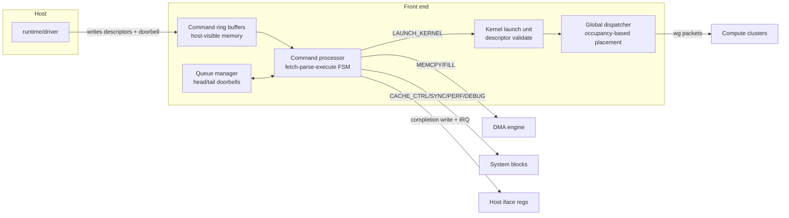

## 6. Front End: Host Interface, Command Processor, Queues, Dispatch

### 6.1 Host interface and register file

MMIO register groups (versioned map; offsets authoritative in CMD-001/DRV-001, group base fixed):

| Group | Base | Content |
|---|---|---|
| Identification | 0x0000 | vendor/arch/RTL version, build/git ID, CU count, SIMD_LANES, feature bits, memory caps |
| Control | 0x0100 | global enable/reset, watchdog config, clock gating enables |
| Command queues | 0x0200 | per-queue base/size/head/tail, doorbells, priorities (P2 multi-queue) |
| DMA | 0x0300 | descriptors, status |
| Interrupts | 0x0400 | status / mask / clear / vector |
| Faults | 0x0500 | fault code, wavefront/CU id, PC snapshot, timestamp, clear |
| Performance | 0x0600 | counter banks, epoch control |
| Debug | 0x0700 | halt/step, state readout ports, trace enables |
| Memory mgmt (G5 placeholder) | 0x0800 | reserved |

`[SPEC GPU-SYS-REQ-004..006, GPU-HIF-REQ-001..004]`

### 6.2 Command set

`NOP · INITIALIZE · MEMCPY · MEMFILL · LAUNCH_KERNEL · BARRIER(queue) · CACHE_CTRL(flush/invalidate scope) · SYNC(queue fence) · PERF_QUERY · DEBUG_OP`. Each command is a descriptor in a host-visible ring: `{cmd_type, flags, params[4], payload_addr, payload_len, seq_id, checksum}`.
Software-equivalent dispatch exists in the ISA simulator from M1; HW CP lands M17. `[GPU-FE-REQ-001/002]`

### 6.3 Kernel launch descriptor

```text
struct sgpu_launch_descriptor {   // little-endian, 64-bit fields
  u64 magic;          // 'SGP1L'
  u32 fmt_version;
  u32 entry_pc;       // kernel entry (word address)
  u32 grid_dim[3];    // workgroups
  u32 wg_dim[3];      // work-items per workgroup (wg_z*wg_y*wg_x ≤ … ≤ 1024 v1)
  u64 arg_addr;       // argument buffer (copied to SGPR block per launch)
  u64 scratch_addr;   // shared-memory backing window (per workgroup)
  u32 vgpr_req;       // VGPRs per work-item
  u32 sgpr_req;       // SGPRs per wavefront
  u32 smem_req;       // bytes per workgroup
  u32 flags;          // deterministic-mode, FTZ, profiling…
  u64 sgp1_image_addr;// SGP1 container (checksum verified pre-launch)
  u64 seq_id;         // completion token
};
```
`[GPU-FE-REQ-003]`

### 6.4 Launch pipeline

Descriptor fetch → validate (magic/version/checksum/register/smem bounds) → capability check →
occupancy query → dispatch loop (§7). Illegal descriptors raise `FAULT_CMD_PARSE` /
`FAULT_MALFORMED_KERNEL`; the queue halts at the offending command (no skip-ahead).
`[GPU-FE-REQ-006]`

### 6.5 Queue semantics

Each queue: monotonic read pointer; head/tail doorbells; completion records appended by device
with `seq_id`. Commands execute strictly in order within a queue; queues are independent
(single queue G1; multi-queue/priority P2). `[GPU-FE-REQ-002, ARCH-INV-013]`

## 7. Global Dispatcher and Work Distribution

The dispatcher converts one grid into workgroup placement decisions:

```
for each workgroup g in grid order:
  select CU c = argmin over eligible CUs of (resident_workgroups(c), cu_index)
     where eligible ⇔ vgpr_req ≤ free_vgpr(c)
                   ∧ sgpr_req ≤ free_sgpr(c)
                   ∧ smem_req ≤ free_smem(c)
                   ∧ resident_wavefronts(c)+ceil(wg_size/32) ≤ WF_slots(c)
  allocate resources atomically on c; emit wg-start packet to c
```

Fairness: strict grid-order with least-loaded CU selection; no starvation possible because every
eligible CU is eventually chosen and completion frees resources deterministically. Occupancy
equations: §31. Placement honors ADR-001 (workgroups map to ceil(wg_size/32) whole wavefronts —
a work-item never splits across wavefronts). `[GPU-FE-REQ-004/005, GPU-SHM-REQ-003]`

**Figure 3 — Cluster hierarchy:**

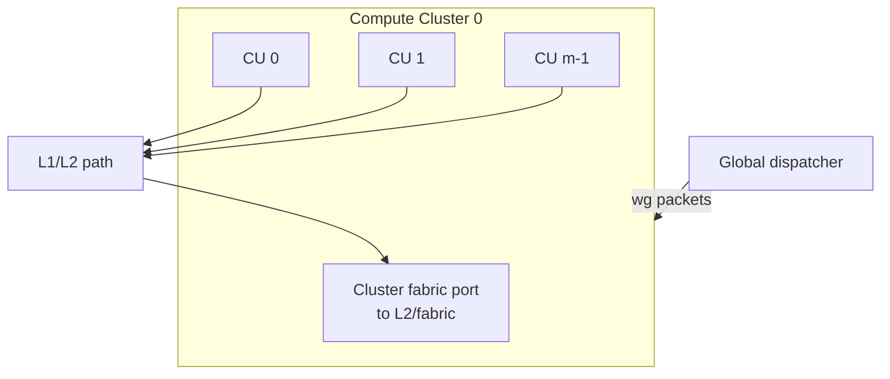
Cluster responsibilities: aggregation point for fabric traffic from its CUs; optional shared
L1-I placement (8–16 KiB per cluster or CU per §28); no architectural coherence role in G1.

## 8. Compute Cluster

A Compute Cluster owns `CU_PER_CLUSTER` CUs and presents exactly one fabric client to the L2/
fabric layer (G1: pass-through arbitration round-robin; M16+: NoC router interface). The cluster
is the replication unit below the device and the unit of FPGA floorplanning granularity.
Cluster-local structures (if configured): shared instruction cache, optional cluster-level
interconnect. Clusters hold **no** global architectural state beyond routing — all architectural
state lives in CUs (§11). `[GPU-SYS-REQ-003, GPU-MEM-REQ-004]`

## 9. Compute Unit (CU) Architecture

**Figure 4 — CU architecture:**

```mermaid
flowchart TB
  subgraph CU["Compute Unit"]
    FE[Fetch + Decode<br/>+ L1-I port]
    SCH[Wavefront Scheduler<br/>RR among ready]
    SB[Scoreboard<br/>per-wavefront reg granularity]
    SCAL[Scalar Unit<br/>+ SGPR file]
    OC[Operand Collector<br/>bank conflict arbiter]
    RFV[VGPR subsystem<br/>lane-striped banks]
    INT[INT pipes]
    FPU[FP32/FP16/BF16 pipes]
    FP64U[FP64 pipe(s) ratio per profile]
    SFU[SFU precise/approx]
    MMA[MMA engine 8×8×8<br/>optional]
    LSU[LSU + Coalescer<br/>+ MSHR tracker]
    SMEM[Shared memory<br/>32 banks × 32 b]
    L1D[L1-D cache]
    BAR[Barrier unit]
    PMC[PMCs / debug ports]
  end
  FE --> SCH
  SCH --> SCAL
  SCH --> OC
  OC --> RFV
  OC --> INT & FPU & FP64U & SFU & MMA & LSU
  SB <--> SCH
  LSU --> SMEM
  LSU --> L1D
  BAR --> SCH
```

Block ownership rules:

| Block | Responsibility | Detail doc |
|---|---|---|
| Fetch/L1-I | word-aligned 64-bit instruction fetch; bandwidth-scalable (§14.2) | MICRO-001 |
| Wavefront scheduler | maintain per-wavefront {PC, EXEC mask stack top, ready/stall reason}; issue RR | SCHED-001 |
| Scoreboard | GPU-EXEC-REQ-008 semantics | REG-001/MICRO-001 |
| Scalar unit | SGPR ops, scalar branches, launch-arg handling | MICRO-001 |
| Operand collector | per-beat 2R+1W assembly from VGPR banks; conflict serialization | REG-001 |
| Vector pipes | INT/FP/SFU/MMA pipelines with latency contracts (§14) | MICRO/FP-001 |
| LSU/coalescer/MSHR | §16 | MEM-001 |
| Shared memory | §18 | MICRO-001 |
| L1-D | §19 | CACHE-001 |
| Barrier unit | workgroup barrier arrivals/departures; illegal-barrier fault | EXEC-001/SCHED-001 |
| PMCs/debug | §25 | DEBUG-001 |

`[SPEC GPU-EXEC-* , GPU-REG-* , GPU-LSU-* , GPU-SHM-* , GPU-CACHE-REQ-001/002]`

## 10. Logical vs Physical Execution Width (normative beat model)

This section is normative; RTL implementers may not reinterpret it. `[ADR-001, GPU-EXEC-REQ-002, GPU-SYS-REQ-016]`

### 10.1 Constants

`WAVEFRONT_SIZE W = 32` (architectural). `SIMD_LANES L ∈ {4,8,16,32}` (µarch). `BEATS B = W / L`.

### 10.2 Beat execution

Issuing one wavefront vector instruction reserves the target pipeline for `B` consecutive cycles
(beats). Beat `k ∈ [0,B)` processes logical lanes `[k·L, (k+1)·L)`:

```
lane_active(k, i) = active_mask[k*L + i]        // slice of the 32-bit mask
operands for beat k = elements [k*L .. k*L+L) of each source VGPR
results of beat k    = written to elements [k*L .. k*L+L) of destination VGPR
```

Inactive lanes produce **no** architectural effect: no register writes, no memory requests, no
faults, no flag updates from their lane position (ARCH-INV-002).

### 10.3 Mask slicing

The scheduler supplies `active_mask` (current top-of-stack 32-bit EXEC value combined with any
predicate source per ISA semantics). Beat k consumes mask bits `[kL, kL+L)` verbatim. Divergence
stack operations themselves are single-beat scalar-side actions (§13, EXEC-001).

### 10.4 Completion and scoreboard readiness

An instruction's *architectural completion event* occurs after its final beat commits:

- ALU-class: destination ready flag set at end of beat B−1 (single scoreboard release).
- Memory loads: completion when all beats' data returned and routed (one tracker entry per
  instruction internally; register-granularity scoreboard sees one pending load).
- MMA/descriptor forms: completion when the tile result commits (fixed internal K-chunk order,
  documented in FP/MICRO docs for numerical determinism).

ARCH-INV-003: a destination may never be marked ready before all required beats complete.

### 10.5 Software invisibility

Kernel binaries, ABI identity registers, divergence semantics, memory model, and the ISA
simulator are defined purely in terms of W=32 lanes. Changing `SIMD_LANES` changes only
throughput/area. Verification obligation: every vector test runs under ≥2 values of L and is
differential-checked against the simulator (§37, R-08 mitigation).

**Figure 5 — Wavefront execution (logical view):**

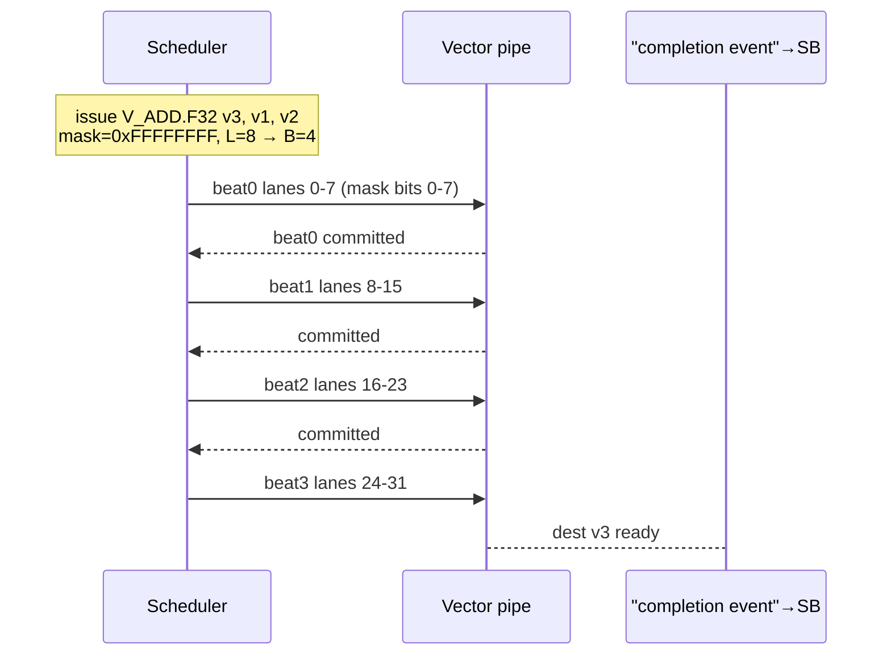

**Figure 6 — Physical lane folding:**

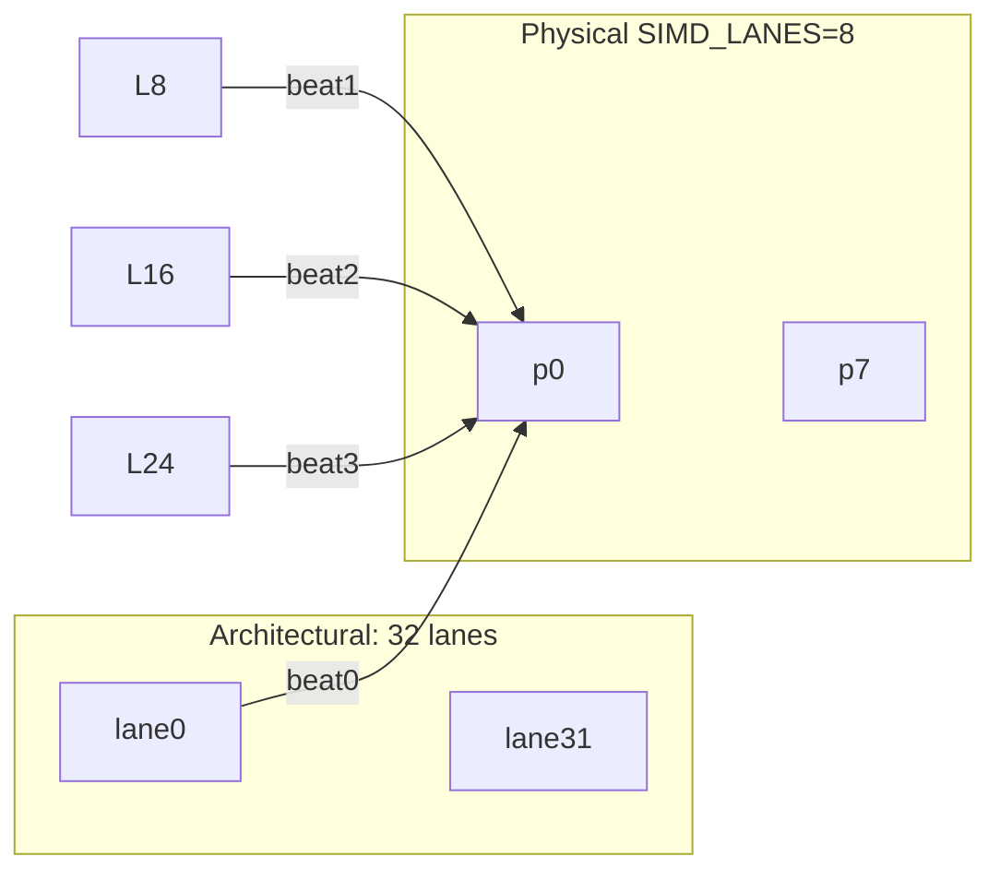

## 11. Architectural State Inventory

| Scope | State | Notes |
|---|---|---|
| Device | ID regs, control regs, queue heads/tails, IRQ/fault blocks, watchdog, perf epochs, build ID | §6, §23–§26 |
| Device (memory system) | L2 tags/data per slice, fabric routes, outstanding transport TIDs | §19–§20 |
| CU | scheduler tables (per resident wavefront: PC, ready/stall), barrier-unit arrival counters, CU PMCs, L1-D/I state, MSHR table, SMEM contents | §9 |
| Wavefront (per resident) | PC; EXEC mask + mask stack (depth MASK_STACK_DEPTH, default 32); VGPR file view (`vgpr_req × 32 lanes × 32 b`); SGPR file (`sgpr_req × 32 b`); predicate regs P0..P15 (32 b each); scoreboard bits; per-instruction outstanding-load tag | ADR-001/002/004 |
| Workgroup | membership list of wavefronts, shared-memory allocation window, barrier generation counters | §18, EXEC-001 |
| Work-item | architectural *view* = one lane slot of wavefront state + private/local address context + per-lane identity (ABI init VGPRs) | SW-001 |

No other architectural state exists. Anything else in RTL is microarchitectural (pipelines,
buffers, CAMs) and must be reset-deterministic (ARCH-INV-006). `[GPU-SYS-REQ-007]`

## 12. Register Architecture (VGPR/SGPR subsystem)

**Organization (ADR-002):** lane-striped banks. Element `(v, i)` — VGPR `v`, lane `i` — lives at
bank `bank(v,i)`, word `row(v,i)` per the REG-001 geometry function; striping guarantees a beat's
`L` accesses touch distinct lane stripes. Logical ports: 2R+1W per vector op per beat; scalar ops
use the SGPR file (own small multiported block). The operand collector maps requested registers
to banks, arbitrates conflicts (serialization), and delivers one full beat operand set per cycle
of pipeline operation.

Configuration surface: `VGPR_COUNT ∈ {32..256}` per work-item (8-bit ISA index), 
`SGPR_COUNT ∈ {64..256}` per wavefront, `RESIDENT_WAVEFRONTS_PER_CU ∈ {2..64}`, all validated
against RF capacity at launch (`FAULT_MALFORMED_KERNEL` on violation).

Hooks mandated now: per-bank parity (SECDED optional HPC), bank-conflict event counters,
parity-error fault injection port. Exact bank count / replication / BRAM-vs-LUTRAM mapping =
REG-001 non-blocking study. `[GPU-REG-REQ-001..005]`

**Figure 7 — Register/operand path:**

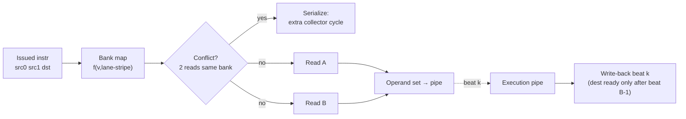

## 13. Scalar/Vector Interaction Semantics

Uniform classification is explicit in ISA v1 (ADR-007): instructions are either `S_*` (SGPR
operands/results) or `V_*` (VGPR operands/results under EXEC mask). Rules:

1. Scalar branches resolve from SGPR/flag values and affect the whole wavefront's PC without
   touching the mask stack.
2. Vector (divergent-capable) branches use the mask stack protocol of EXEC-001: push masks for
   the two paths + reconvergence target.
3. Scalar→vector data flows by explicit `V_MOV` from SGPR broadcast; vector→scalar reduction
   requires explicit collectives (reserved ISA v1 range) or memory round-trip.
4. Launch arguments are written to the wavefront's SGPR argument block at dispatch; per-lane
   identity (global/local IDs, linear lane id) is written to ABI-designated VGPR startup
   registers by hardware at wavefront creation (values differ per work-item — never in SGPRs).
5. Scalar unit and vector pipes may overlap execution across different wavefronts; within one
   wavefront, issue remains in-order (G1), so scalar/vector dependencies serialize through the
   scoreboard like any other pair.

`[GPU-EXEC-REQ-009, GPU-SW-REQ-005]`

## 14. Execution Pipelines and Latency Contracts

### 14.1 Latency classes (ARCH level; exact cycles = MICRO/FP docs)

| Class | Meaning | Examples | Scoreboard interaction |
|---|---|---|---|
| F1 fixed-short | fixed latency, II=1, result ready end-of-final-beat | INT ALU/logic/shifts, FP32 add/mul/FMA, SGPR ops | standard dest-ready |
| F2 fixed-multi | fixed longer latency, II≥1 | MULHI, POPCNT-wide, CVT, predicate ops | dest-ready after stated depth |
| V variable-bounded | variable within documented bound | precise DIV/SQRT/RCP/RSQRT (iterative), MMA tile with K-chunks | reservation tracker holds FU; single completion |
| D decoupled | completion via response path | loads/stores/atomics/DMA/SMEM misses to L2 | outstanding-load/store/atomic entries |
| S stall-on-resource | blocks at scheduler until resource free | barrier wait, queue fence | barrier dependency bit |

Issue restrictions recorded per pipe in MICRO-001 (structural conflicts); G1 is single-issue per
CU (scalar or vector each cycle), so contracts reduce to "one instruction occupies its pipe for
its stated beats/depth."

### 14.2 Fetch bandwidth scalability

64-bit instructions with rare 128-bit forms: fetch delivers ≥1 instruction/cycle at target
clocks; L1-I line 64 B (8 instructions) gives natural bandwidth headroom; wider fetch is a
per-profile µarch option that must not change semantics. `[GPU-ISA-REQ-002]`

## 15. Scheduling Hierarchy and Wavefront Scheduling

Full chain: host command → kernel (SGP1 image) → grid → workgroups → CU allocation (dispatcher)
→ resident wavefronts (CU creates ceil(wg_size/32) wavefronts, initializes PC=entry, EXEC=all-
active-or-partial-mask, SGPR args, VGPR identity regs) → instruction issue loop.

Wavefront states: `IDLE(slot empty) · READY · ISSUED(beats pending) · WAIT_SCOREBOARD ·
WAIT_MEMORY · WAIT_BARRIER · DONE`. Policy: deterministic round-robin over READY wavefronts,
skipping those whose scoreboard blocks their oldest instruction; scalar and vector issue share
the single G1 issue slot. Fairness: RR guarantees no starvation among READY wavefronts
(ARCH-INV-011 constrains legality of issue). Advanced policies = P2 studies (SCHED-001).
`[GPU-EXEC-REQ-005/006/007]`

**Figure 8 — Scheduling flow:**

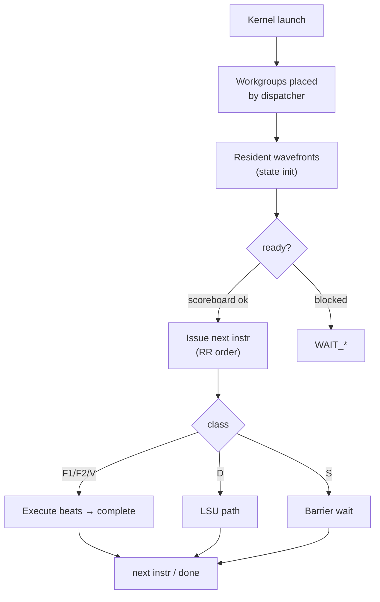

## 16. Load/Store Path and Coalescing

Path: address computation (scalar base + vector offsets or SMEM/local windows) → LSU accepts one
wavefront memory instruction → **per-beat coalescing**: beat k's L active-lane addresses are
grouped into minimal transport transactions (same 64-B-line merging where byte ranges are
contiguous or mergeable; unaligned handling per MEM-001 policy) → transactions carry TID +
instruction tag → MSHR-class tracker records one *pending-load entry per destination register*
plus per-transaction state internally → responses routed back to lanes by (beat, lane-offset)
map derived at request time.

Rules: masked-out lanes generate no transactions (ARCH-INV-016); a coalesced transaction covers
only addresses requested by active lanes (INV-017); stores are fire-and-forget with ordering per
MEM-001; atomics serialize at the L2 point of coherence. `[GPU-LSU-REQ-001..004, GPU-MEM-REQ-003]`

**Figure 9 — Load/store path:**

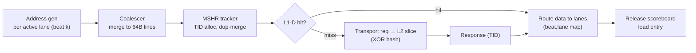

## 17. Memory Hierarchy

```
VGPR/SGPR ↔ execution ↔ [shared memory | private-local window]
                     ↘ L1-D (write-through G1 default) ↘
L2 slices {1,2,4,8,16} — XOR-hash interleaved, point of coherence & atomics
        ↘ vendor-neutral transport ↘ fabric (crossbar → NoC) ↘ platform DDR/HBM
```
**Figure 10 — Memory hierarchy** (levels and ownership):

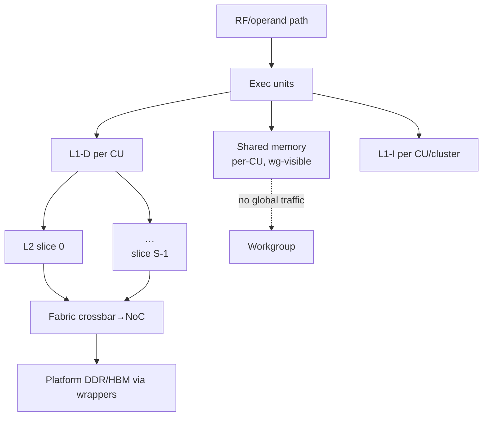

Address spaces (all 64-bit): **global** (device memory + host-mapped IOVA), **shared** (CU
scratchpad windows per workgroup), **private/local** (implementation: shared-memory region or
global backing — choice visible only as performance; semantics identical, MEM-001),
**read-only/constant** (P2). Coherence G1: explicitly synchronized — L1-D write-through/no-write-
allocate default; flush/invalidate commands at kernel/workgroup boundaries; DMA visibility rules
in MEM-001 §visibility. `[GPU-CACHE-REQ-001..006, GPU-MEM-REQ-001]`

## 18. Shared Memory Architecture

Per-CU scratchpad, workgroup-visible, software-managed, **32 banks × 32-bit words, 4-byte
granularity**. Access model: one wavefront memory op per beat touches ≤ L ≤ 32 banks; same-word
accesses across lanes broadcast (no conflict); two distinct addresses in the same bank
serialize (conflict counted). Capacity per profile: 16 KiB MINIMAL / 64 KiB MEDIUM / 64 KiB
LARGE / 64 KiB default configurable to 128 KiB HPC. Allocation: dispatcher grants contiguous
window per resident workgroup; `smem_req` overflow → launch fault. Bank-conflict statistics
exposed via PMCs. `[GPU-SHM-REQ-001..003]`

**Figure 11 — Shared-memory architecture:**

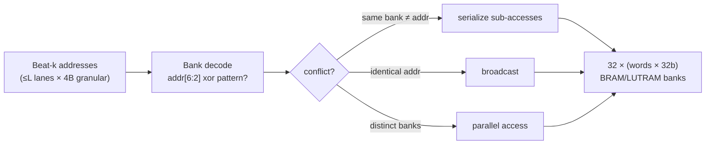

## 19. L1 / L2 / Memory Fabric

**L1-D**: per CU, ~32 KiB class medium/large, set-associative (4-way capable), 64-B lines
(ADR-003), write-through/no-write-allocate G1 default; replacement pseudo-LRU default (policy
study non-blocking). MINIMAL may omit L1-D (LSU→L2 direct) — capability-reported.

**L1-I**: separate; 8–16 KiB per CU or cluster; read-only; miss path shares fabric.

**L2**: unified slices, each fully owning an address interleaving class selected by
**power-of-two XOR hashing of cache-line address bits** (exact map parameterized; CACHE-001
tunes with conflict traces). Slice count ∈ {1,2,4,8,16}. L2 is: point of coherence, atomics
serialization point, write-back cache vs DRAM, SECDED-protected (HPC/scientific configs).
Slice-to-channel mapping considers platform topology (FPGA wrapper exposes channel geometry;
configuration-only effect).

**Fabric**: G1–G3 crossbar (round-robin, per-client credit backpressure); M16+ NoC encapsulates
the same transport packets (source, destination, TID, address, op, BE, data, response info).
Deadlock analysis obligations: §32.3. `[GPU-CACHE-REQ-001/002/003/004, GPU-MEM-REQ-004/005]`

**Figure 12 — L1/L2/fabric:**

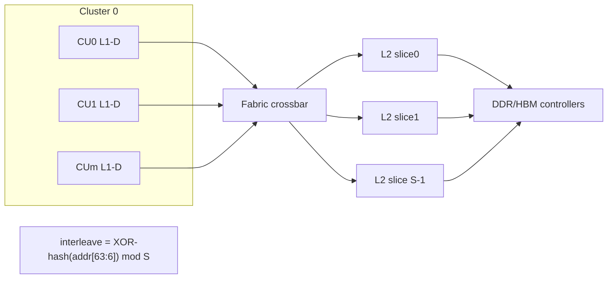

## 20. Internal Memory Transport (vendor-neutral)

Normative field set (ADR-008; full signal/timing spec = MEM-001):

| Direction | Fields |
|---|---|
| Request | req_valid, req_ready, operation (RD/WR/ATOMIC/PREFETCH/CTRL), address[63:0], size (1/2/4/8/B-line), tid[11:0 cfg], burst_len, wdata[GPU_MEM_DATA_W-1:0], byte_enable[w/32], scope(2 b), ordering(2 b), cache_hint(2 b), atomic_op(5 b), source_id(CU/wg/wavefront tag) |
| Response | rsp_valid, rsp_ready, tid, rdata[GPU_MEM_DATA_W-1:0], status/error code, last |

Parameters: `GPU_ADDR_W=64` fixed; `GPU_MEM_DATA_W` default 256 (configurable);
`TID_WIDTH` ≈12 b configurable — structures sized by parameter, never hard-coded
(GPU-MEM-REQ-002). Ordering: responses strictly matched to requests 1:1 by TID within a source
(INV-004); no reordering guarantees beyond MEM-001 axioms; every link valid/ready with
credit-based or stall-on-full flow control chosen per link class (MEM-001 tables).

**Figure 13 — Generic request/response:**

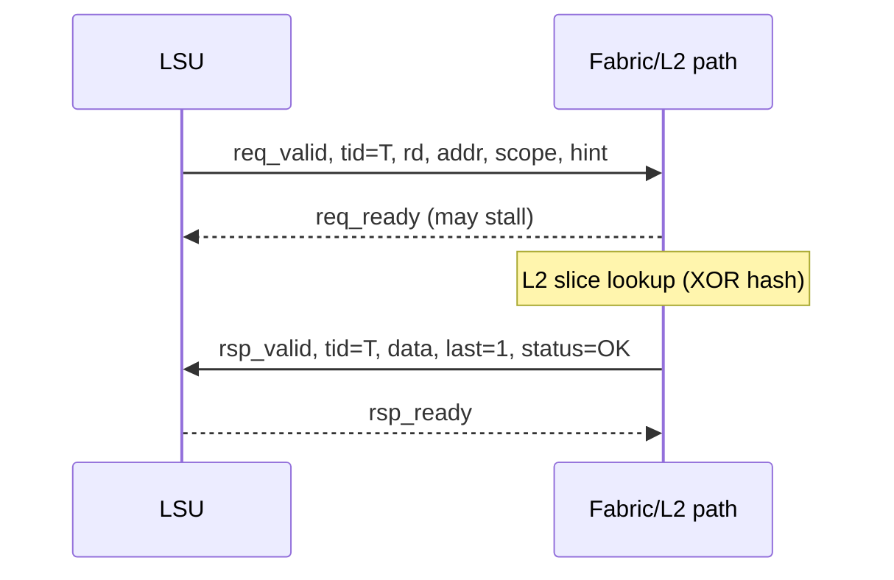

## 21. Memory Consistency Summary

Normative model: MEM-001. Architectural summary:

- Scopes: **wavefront ⊂ workgroup ⊂ device**.
- Plain accesses: relaxed; each work-item observes its own accesses to a location in program
  order; no other guarantee absent synchronization.
- Synchronization: `acquire load` / `release store` / acquire-release RMWs at a stated scope;
  fences (workgroup/device) ordering plain accesses; workgroup **barrier** = execution join +
  workgroup-scope release→acquire effect (all pre-barrier writes of every member visible to all
  post-barrier reads).
- Atomics: single-copy atomic per location; relaxed default; acq/rel attributes later (§12.14
  schedule); serialized at L2.
- No out-of-thin-air values; causality preserved through release/acquire chains.

ISA exposes scope/ordering bits on memory instructions (GPU-ISA-REQ-010). Litmus-test suite in
MEM-001 doubles as RTL assertions/formal properties. `[GPU-MEM-REQ-001, GPU-ISA-REQ-011]`

## 22. DMA and Host Data Path

DMA engine: descriptor queues (scatter-gather entries: src/dst 64-bit, length, stride, flags),
H2D/D2H/D2D, multiple outstanding descriptors, completion interrupt with coalescing counter.
Data path rides the same transport/fabric (source_id=DMA) so visibility obeys MEM-001 identically
(no side doors). Host↔queue doorbells are MMIO writes; completions append ring records then raise
IRQ per mask. `[GPU-HIF-REQ-001/002, GPU-FE-REQ-002]`

**Figure 14 — DMA/host path:**

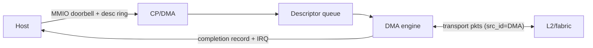

## 23. Interrupt and Fault Architecture

Interrupt sources (status/mask/clear per source; single output line + cause vector):
command-completion, kernel-completion, DMA-completion, fault, memory-error(ECC), watchdog,
debug-trap.

Fault codes (v1 assignment; authoritative table in CMD-001/DRV-001):

| Code | Fault |
|---|---|
| 0x01 ILLEGAL_OPCODE | undecodable/reserved opcode executed |
| 0x02 INVALID_REGISTER | VGPR/SGPR index ≥ declared requirement |
| 0x03 INVALID_ADDRESS | unmapped/out-of-window access |
| 0x04 ALIGNMENT | misaligned access when policy=fault |
| 0x05 MASK_STACK_OVERFLOW | exec-mask stack push past depth |
| 0x06 MASK_STACK_UNDERFLOW | pop on empty stack |
| 0x07 ILLEGAL_BARRIER | barrier mismatch/duplicate arrival |
| 0x08 WATCHDOG_TIMEOUT | kernel exceeded watchdog limit |
| 0x09 ECC_UNCORRECTABLE | UE in protected structure |
| 0x0A CMD_PARSE_ERROR | malformed command descriptor |
| 0x0B MALFORMED_KERNEL | bad SGP1/checksum/resource overrun |
| 0x0C INTERNAL_CONSISTENCY | invariant violation detected (fatal) |
| 0x0D TIMEOUT | transport/watchdog sub-timeout |
| 0x0E DEBUG_TRAP | intentional halt |

Fault capture record: {code, CU, wavefront, PC snapshot, address/aux, timestamp}. A fault halts
the offending queue/kernel; other queues continue unless classified fatal (INTERNAL). Errors can
never be reported as successful completion (INV-007). `[GPU-SYS-REQ-009/010, GPU-HIF-REQ-003]`

**Figure 15 — Interrupt/fault path:**

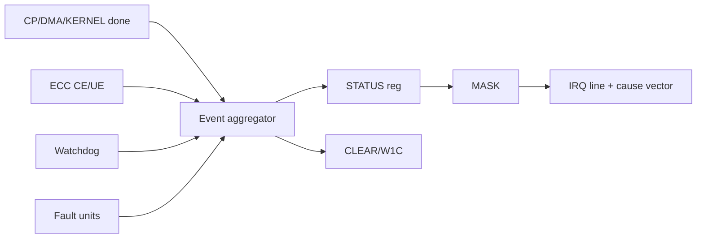

## 24. Clock and Reset Architecture

Clocks (C-09): G1–G3 = single `clk_gpu` primary domain; host/platform interface may run `clk_if`;
crossings restricted to sanctioned primitives (2-FF level sync for single-bit; handshake or async
FIFO for buses; Gray-code counters) — each crossing itemized in a CDC register with category.
Memory-controller clock adaptation happens in `platform/amd/`. Frequency never alters semantics
(GPU-SYS-REQ-016). Planning targets per profile: ≈150 MHz 7-series / ≈200 MHz ZUS+ / 250–300 MHz
U55C (evidence-gated claims).

Reset: synchronous active-high `rst` internally, platform-adapted at boundary. Reset classes:
global, front-end/queues, per-cluster/CU, memory-subsystem (flush-aware), debug. All architectural
in-flight state cleared; post-reset state equals power-on spec per module (INV-006). Watchdog and
fault blocks self-clear on global reset only. `[GPU-SYS-REQ-007/008, GPU-RAS-REQ-006]`

**Figure 16 — Clock/reset domains:**

```mermaid
flowchart LR
  subgraph Platform["platform/amd"]
    PSCLK[clock/reset pins] --> PLL[PLL/BUFG]
  end
  PLL --> CG[clk_gpu gated tree]
  PLL --> IFC[clk_if interface clock]
  CG <-."async FIFO/handshake CDC"| IFC
  PSCLK --> RSYS[rst synchronizer] --> CORE[Core resets<br/>global/FE/CU/mem/debug]
```

## 25. Debug, Performance Monitoring, RAS

Debug: halt/step control, wavefront state readout (PC, EXEC stack, scoreboard summary), SGPR/
VGPR windowed readback, memory peek, command/fault trace buffers (configurable depth, disabled by
default in production builds). Build ID register mandatory (git-derived).

PMCs (banks per CU + device): cycles, instructions issued (S/V), beats executed, active-lane
cycles, stalled-wavefront cycles by reason, FP32/FP64/MMA op counts, loads/stores/atomics,
cache hits/misses, SMEM conflicts, RF-bank conflicts, divergence events, fabric occupancy, DRAM
transactions. Epoch start/stop via PERF group. Profiling API maps onto these (SW-001).

RAS: parity/SECDED placement per GPU-RAS-REQ-001 (RF parity, SMEM/L2 SECDED sci/HPC, cmd mem per
criticality), error-injection ports wherever protection exists, CE/UE counters with location+
timestamp, poison propagation flag on transport status, fatal/nonfatal classification feeding §23.
Watchdog: per-kernel cycle budget, disable/graceful-abort/hard-reset modes.
`[GPU-DBG-REQ-001..005, GPU-RAS-REQ-001/002, GPU-SYS-REQ-009]`

**Figure 17 — Debug/performance architecture:**

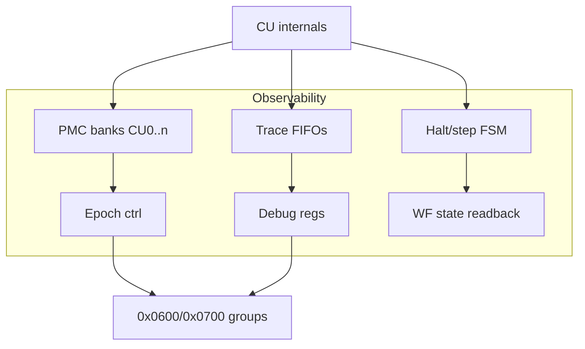

## 26. Security and Isolation Hooks

G1–G4 baseline: command validation (magic/version/bounds/opcode legality), address windows per
allocation (launch-time bounds checked in LSU path — out-of-window → INVALID_ADDRESS fault),
privilege bit distinguishing driver-only commands (DEBUG_OP, CACHE_CTRL global, watchdog) from
enqueue-allowed ones, checksummed SGP1 images. Future hooks kept open: context/ASID fields in
transport source_id encoding space (G5), IOMMU at platform layer, protected command buffers.
`[GPU-FE-REQ-006, GPU-RAS-REQ-003]`

## 27. Parameterization Model (architectural vs microarchitectural)

The critical SciGPU distinction (P1): parameters are classified, and nothing below the line may
change software-visible behavior.

### 27.1 Architectural parameters (software/ISA visible)

| Parameter | Value | Notes |
|---|---|---|
| WAVEFRONT_SIZE | 32 | ISA v1 fixed (ADR-001) |
| ISA version | v1.0 | capability register |
| Address width | 64-bit | GPU_ADDR_W |
| Predicate registers | 16 × 32-bit per wavefront | ISA visible P0..P15 |
| Mask stack depth semantics | overflow/underflow = faults; depth itself is µarch (≥32) | EXEC-001 |
| Memory scopes/ordering/hints encodings | per MEM-001 | ISA attribute bits |

### 27.2 Microarchitectural parameters (performance/resource only)

`SIMD_LANES {4,8,16,32}` · `NUM_CLUSTERS` · `CU_PER_CLUSTER` · `RESIDENT_WAVEFRONTS_PER_CU`
· `VGPR_COUNT` · `SGPR_COUNT` · `SHARED_MEM_BYTES` · `L1_D_SIZE/L1_I_SIZE` · `L2_SIZE/L2_SLICES`
· `MASK_STACK_DEPTH (default 32)` · `TID_WIDTH (~12)` · `GPU_MEM_DATA_W (256 default)` ·
`MAX_OUTSTANDING_MEM_REQ` · `FP64_RATIO {off, 1:8, 1:4, 1:2, 1:1}` · `MATRIX_UNITS {0..n}` ·
queue count/priorities.

Elaboration-time validation enforces legal combinations (e.g., FP64_RATIO≠off requires
FP64-capable pipe config; MATRIX_UNITS>0 requires FP16/BF16 paths). `[GPU-SYS-REQ-003/013/016]`

## 28. Configuration Profiles

Planning direction (envelopes, not achieved designs — SPEC §11):

| | MINIMAL | MEDIUM | LARGE | HPC |
|---|---|---|---|---|
| Clusters × CUs | 1×1 | 1–2 × 2–4 | 2–4 × 4–8 | 4–16 × 4–8 |
| SIMD_LANES | 4 or 8 | 8–16 | 16–32 | 32 where resources permit |
| Resident wavefronts/CU | 2–4 | 8–16 | 16–32 | 16–64 |
| VGPR/SGPR | 32–64 / 32–64 | 64–128 / 64–128 | 128–256 / 128–256 | 128–256 / 128–256 |
| Shared mem/CU | 16 KiB | 64 KiB | 64 KiB | 64 KiB→128 KiB |
| L1-D / L1-I | optional / 8 KiB | ~32 K / 8–16 K | ~32 K / 8–16 K | ≥32 K / 8–16 K |
| L2 (size/slices) | none–small/1 | 128–512 K/1–2 | 1–4 MiB/4–8 | multi-MiB/8–16 |
| FP64 ratio | off or ≈1:8 | 1:4 | 1:2 | 1:2 (1:1 option) |
| MMA units/CU | 0 | 0–1 | 1 | 1 |
| FPGA stage | A | B | C/D | D |

All profiles share WAVEFRONT_SIZE=32 and identical kernel binaries. `[SPEC §11, GPU-FPGA-REQ-002]`

**Figure 18 — Parameterized scaling:**

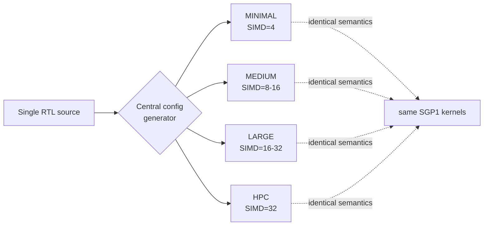

## 29. Floating-Point Resource Coexistence

Per CU pipeline families share the operand collector and write-back path:

- **FP32 family**: FMA-based add/mul/FMA/FMS (F1 class), CVT unit, compare/classify.
- **FP16/BF16 family**: storage/pack formats, conversions to/from FP32, MMA input paths,
  dot-products with FP32 accumulate.
- **FP64 family**: dedicated pipes at profile ratio (ADR-005); true-fused FMA; shares
  normalization methodology but distinct hardware; ratio implemented by instantiating N_fp64 =
  N_fp32 × ratio lane-pipes (or time-sharing in MINIMAL ≈1:8 builds).
- **SFU**: precise (div/sqrt/rcp/rsqrt — V-class iterative) and approximate (polynomial/
  range-reduction — F1/F2 class) ports; error targets owned by FP-001.

Arbitration: static priority when multiple instructions of one wavefront contend is unnecessary
(single issue); cross-wavefront contention resolved by scheduler RR + per-pipe reservation
trackers (V-class). FTZ mode bit per wavefront control SGPR (documented semantics).
`[GPU-FP-REQ-001..010, ADR-005]`

## 30. Matrix Engine Integration

MMA (ADR-006) is a CU-local V-class unit: descriptor/tile operands arrive via the operand
collector from VGPR tiles (A: 8×8, B: 8×8, C/D accumulators 8×8 FP32/INT32 held in VGPR blocks);
execution proceeds in fixed internal K-chunk order (deterministic accumulation documented);
completion releases the accumulator destination registers. Types v1: FP16→FP32acc, BF16→FP32acc,
INT8→INT32acc. Larger logical GEMMs = software loops over micro-tiles with shared-memory staging
(UC-03). Coexistence rule: MMA occupies its reservation ≤ bounded depth; vector issue never
starves > documented bound (test obligation §37). Dot-product instructions reuse MMA datapath at
sub-tile granularity. `[GPU-MAT-REQ-001..004]`

## 31. Occupancy Model and PERF-001 Hooks

Occupancy equations (per CU):

```
WF_vgpr  = floor( RF_VGPR_capacity_lanes / (vgpr_req × 32) )
WF_sgpr  = floor( SGPR_capacity        / sgpr_req )
WF_slots = RESIDENT_WAVEFRONTS_PER_CU
WG_mem   = floor( SHARED_MEM_BYTES / max(smem_req,1) )      // workgroup granularity
WGs_res  = min( WG_mem, floor(WF_min × 32 / wg_size) )
where WF_min = min(WF_vgpr, WF_sgpr, WF_slots)
```

PERF-001 models exactly these quantities: CUs, SIMD_LANES, beats/instr (=32/SIMD_LANES),
pipeline latencies/IIs by class (§14), FP64 ratio, MMA tile rate, RF port bandwidth
(beats/cycle), SMEM bandwidth (banks/cycle), L1/L2/fabric bandwidths, external BW, occupancy
(above), scheduler issue efficiency. No performance numbers are asserted in ARCH-001;
PERF-001 owns formulas + targets (`[GPU-PERF-REQ-001/006/008]`, directive §43).

## 32. Scalability Limits, Bottlenecks, Deadlock Analysis

### 32.1 Known scaling limits

| Limit | Boundary | Consequence |
|---|---|---|
| Single-issue per CU (G1) | IPC<1 per CU | Mitigated by wavefront interleaving; dual-issue = SCHED-001 P2 study |
| Crossbar fabric | O(N²) growth beyond ~16–32 clients | NoC required for HPC scale (M16+) |
| RF capacity | residency vs VGPR_COUNT tradeoff | occupancy equations bound concurrency |
| SMEM banks (32×32 b) | 128 B/cycle/CU ceiling | tiled kernels sized accordingly |
| Transport TID space | outstanding ≤ 2^TID_WIDTH per source class | parameterized; histograms tune width |

### 32.2 Bottleneck attribution (design-time)

Compute-bound vs memory-bound classification per kernel via roofline (PERF-001); structural
bottlenecks monitored via mandated counters (RF conflicts, SMEM conflicts, L2 slice hotspots via
XOR-hash distribution counters, scheduler stall reasons).

### 32.3 Deadlock analysis obligations (each gets explicit proof in its owning doc)

1. **Transport**: request/response independent channels; response never depends on a new request
   being accepted → no circular wait on full request buffers. Credit/stall rules per link (MEM-001).
2. **MSHR exhaustion**: new memory issues stall at LSU *before* consuming transport slots → no
   partial-allocation deadlock.
3. **Barriers**: barrier wait consumes no transport resources; arrivals counted independently of
   memory progress → cannot deadlock against memory backpressure.
4. **Command queues**: CP consumes descriptors monotonically; completion records have guaranteed
   ring space (driver contract) else fault not hang.
5. **NoC (M16)**: dimension-order routing + separate virtual channels for request/response
   classes; formal acyclicity check (NOC-001).
6. **DMA vs compute sharing fabric**: round-robin fairness; DMA never holds locks across
   requests.

### 32.4 Fairness & starvation

Every arbiter states a policy (RR baseline) and a starvation bound; test obligations in VER-001
(GPU-MEM-REQ-006). `[GPU-MEM-REQ-005/006/007]`

## 33. Architecture Invariants (assertion/formal seed list)

| ID | Invariant |
|---|---|
| ARCH-INV-001 | Every wavefront architecturally contains exactly 32 work-items; masks are 32-bit regardless of SIMD_LANES. |
| ARCH-INV-002 | Inactive lanes never modify architectural state (registers, flags, predicates, memory, counters attributed to lanes). |
| ARCH-INV-003 | An instruction destination becomes scoreboard-ready only after all execution beats (or decoupled completions) of that instruction commit. |
| ARCH-INV-004 | Every memory response matches exactly one outstanding request (TID, source); duplicate/orphan responses are protocol violations. |
| ARCH-INV-005 | A completed workgroup retains no live barrier state; barrier generation counters return to rest. |
| ARCH-INV-006 | Reset clears all architectural in-flight state; post-reset observation equals power-on state; no ghost completions after reset. |
| ARCH-INV-007 | Errors/faults never surface as successful command/kernel completion. |
| ARCH-INV-008 | Exec-mask stack is balanced at kernel entry/exit boundaries; overflow/underflow raises MASK_STACK faults (never silent wrap). |
| ARCH-INV-009 | Per-location coherence: accepted writes to one address appear in a single total order consistent with MEM-001 axioms. |
| ARCH-INV-010 | Single-copy atomicity for atomic operations at their scope. |
| ARCH-INV-011 | The scheduler issues an instruction only when its sources are scoreboard-ready and its unit reservation is grantable. |
| ARCH-INV-012 | Barrier arrival counts equal exactly the workgroup's resident wavefronts, each arriving once per generation. |
| ARCH-INV-013 | Command queues execute descriptors exactly once, in order; read pointers monotonic; no skip/duplicate. |
| ARCH-INV-014 | DMA completion interrupts assert only after data meets MEM-001 visibility for subsequent device reads. |
| ARCH-INV-015 | PMC counters increment monotonically within an epoch; documented wrap behavior only. |
| ARCH-INV-016 | Masked-out lanes generate zero memory transactions. |
| ARCH-INV-017 | A coalesced transaction covers only byte ranges requested by active lanes of that beat. |
| ARCH-INV-018 | Read responses carry data only for requested byte-enables; other bytes are deterministic-fill (zero) or error. |
| ARCH-INV-019 | Watchdog abort leaves all architectural state inspectable and resettable. |
| ARCH-INV-020 | A fault halts its queue/kernel; unrelated queues proceed unless fault is classified fatal. |
| ARCH-INV-021 | Register indices ≥ declared requirement raise INVALID_REGISTER before any architectural effect. |
| ARCH-INV-022 | SGP1 images are checksum-verified before first instruction fetch; failed verification launches nothing. |
| ARCH-INV-023 | Identification/build registers are read-only after reset. |
| ARCH-INV-024 | Multi-bit buses cross clock domains only through registered CDC constructs from the sanctioned register (handshake/FIFO/Gray/2FF-singlebit). |
| ARCH-INV-025 | Changing SIMD_LANES (any value) leaves every architectural result bit-identical for the same binary+inputs+config-semantics. |

These become SVA/Formal properties (VER-001 maps each to tests).

## 34. Interface Tables

Format: producer → consumer · purpose · ordering · backpressure · IDs · widths · errors · domain.
Widths marked † are parameterized.

### 34.1 MMIO register bus (host ↔ device blocks)

Producer host/CP · Consumer all block CSRs · Purpose control/status · Ordering: single outstanding
per CPU access · Backpressure: ready stall · IDs: address-decoded · Widths 32 b data, 24 b reg
addr · Errors: decode fault → CMD_PARSE · Domain clk_if↔clk_gpu CDC wrapper.

### 34.2 Queue doorbell (host → CP)

Purpose notify descriptor availability · Ordering per-queue FIFO · Backpressure n/a (MMIO) ·
IDs queue_id · Errors unknown queue fault · Domain CDC.

### 34.3 Dispatcher → CU workgroup-start packet

Ordering per-CU in-order · Backpressure credit (CU advertises free slots) · IDs wg_id, grid seq ·
Payload: launch params ref · Errors resource-check reject pre-dispatch · Domain clk_gpu.

### 34.4 Scheduler ↔ pipelines (issue)

One instruction/cycle · Ordering in-order per wavefront · Backpressure pipe busy/reservation full ·
IDs wavefront tag · Errors none inline (faults via exception port) · Domain clk_gpu.

### 34.5 Operand collector ↔ RF banks

2R+1W per beat† · Ordering per-beat atomic · Backpressure conflict serialization · IDs beat tag ·
Domain clk_gpu.

### 34.6 Pipelines → write-back

Result + dest + wavefront tag · Completion-only-after-final-beat (INV-003) · Widths 32 b × L† ·
Domain clk_gpu.

### 34.7 LSU ↔ shared memory

Beat-k addresses ≤L† · Same-bank serialization · Widths 32 b granular · Domain clk_gpu.

### 34.8 LSU ↔ L1-D / L2 (transport, §20)

Fields per ADR-008 · Ordering: per-source FIFO; scopes carried · Backpressure valid/ready +
credits† · IDs tid† + source_id · Errors status codes (§23 table) · Domain clk_gpu.

### 34.9 L1-I fetch ↔ I-cache

Word-aligned 64 b instr(s)/cycle† · Miss → transport · Errors fetch-ECC future hook · Domain
clk_gpu.

### 34.10 Barrier unit ↔ scheduler

Arrive/release events · Ordering per-workgroup generations · Errors ILLEGAL_BARRIER fault ·
Domain clk_gpu.

### 34.11 CP ↔ DMA engine

Descriptor consume/complete handshake · Multiple outstanding† · Errors descriptor faults halt
queue (INV-007/020) · Domain clk_gpu (clk_if adaptation at platform).

### 34.12 Device IRQ → platform

Level/single-line + cause vector · Clear-on-ack · Domain CDC at pins.

### 34.13 Debug readback ports

Halted-state only (INV-19 interplay) · Widths windowed 32 b reads · Domain clk_gpu, exported via
clk_if MMIO.

## 35. FPGA Mapping Strategy

Per stage (ADR-009): **FPGA-A** ZC702-class — MINIMAL config, SIMD_LANES 4–8, RF in BRAM,
no/mini L1, basic DDR via platform wrapper; purpose = architecture/functionality experimentation
only. **FPGA-B** ZCU104-class — PS/PL AXI integration, Vitis bare-metal driver target, medium
config ≈200 MHz planning. **FPGA-C/D** U55C — multi-CU, SIMD up to 32, HBM experiments, L2
slicing/coalescing/NoC studies, PCIe host, 250 MHz baseline/300 stretch. Vendor primitives only
in `platform/amd/vivado_2025_2/`; scripted Tcl builds; XSA handoff artifacts; metrics recorded
incl. negatives (GPU-FPGA-REQ-004..006). DSP strategy: INT8/FP16/BF16 MACs → DSP48E2 cascades;
FP32 FMA → DSP+fabric hybrid; FP64 → fabric pipelines (ADR-005 consequences). `[GPU-FPGA-*]`

## 36. ASIC Portability Considerations

Synchronous single-clock core; standard-cell-friendly structures (SRAM macros map onto RF banks,
SMEM, caches via REG/CACHE-001 geometry hooks); no latches, no vendor IP inside core; scan/reorder
constraints left open by documented pipeline stages; ECC hooks upgrade to on-the-fly SECDED ASIC
IP without interface change; NoC replaces crossbar behind the same transport. Nothing in this
document presumes FPGA-only shortcuts (e.g., no SRL-as-RF dependency).

## 37. Architecture Verification Obligations

1. Beat-model equivalence: every vector instruction differential-tested under ≥2 SIMD_LANES vs
   ISA simulator (R-08; INV-001/002/003/025).
2. Invariants ARCH-INV-001..025 → assertions + selected formal properties (VER-001 mapping table).
3. Memory model litmus suite (MEM-001) runs on simulator AND RTL cosim.
4. Deadlock proofs (§32.3) → targeted formal where feasible + long stress tests otherwise.
5. Fairness/starvation directed tests per arbiter.
6. Resource-exhaustion tests (full MSHR/TIDs/rings/barriers) with defined behavior.
7. Fault-injection: every RAS protection + every fault code path exercised.
8. Perf validation separated from correctness suites (GPU-PERF-REQ-005).

## 38. Requirement Traceability Map

| SPEC group | ARCH-001 sections |
|---|---|
| GPU-SYS-REQ-001..016 | 1,2,3,9,11,24,27,28,33(INV-006/007/023) |
| GPU-ISA-REQ-001..017 | 10,14.2,20,21,26,30 (+ISA-001 normative) |
| GPU-INT-REQ-001..006 | 14 (F1/F2/V classes) |
| GPU-FP-REQ-001..013 | 14,29 |
| GPU-SFU-REQ-001..004 | 14,29 |
| GPU-MAT-REQ-001..004 | 30 |
| GPU-EXEC-REQ-001..012 | 9,10,12,13,15,33 |
| GPU-REG-REQ-001..005 | 12,34.5/34.6 |
| GPU-LSU-REQ-001..004 | 16 |
| GPU-SHM-REQ-001..003 | 18 |
| GPU-CACHE-REQ-001..006 | 17,19 |
| GPU-MEM-REQ-001..007 | 16,17,19,20,21,32 |
| GPU-ATM-REQ-001..002 | 19,21 |
| GPU-FE-REQ-001..006 | 6,7 |
| GPU-HIF-REQ-001..006 | 6,22,23,34 |
| GPU-DBG-REQ-001..005 | 25 |
| GPU-RAS-REQ-001..006 | 24,25,26 |
| GPU-SW-REQ-001..013 | 6.3,11,13 (ABI details → SW-001) |
| GPU-VER-REQ-001..017 | 37 |
| GPU-FPGA-REQ-001..012 | 35 |
| GPU-DOC-REQ-001..014 | document set itself |
| GPU-PERF-REQ-001..009 | 31,32 |

## 39. Open Items and Non-Blocking Studies

Carried from SPEC-000 §15.3 with owners (CACHE-001 XOR map & replacement policy; REG-001 bank
geometry; MEM-001 TID width finalization & signal timing tables; FP-001 div/sqrt algorithm &
SFU error tables; MICRO-001 L1-I sizing, store buffer depth; NOC-001 topology; CMD-001 watchdog
defaults, queue counts; SCHED-001 advanced policies). None are architecture holes; each names
its resolving evidence. New from ARCH review: none blocking — see self-review.

## 40. Self-Review Reference

Completeness/consistency checks recorded in `reviews/ARCH_001_SELF_REVIEW.md`.

*End of ARCH-001 Rev 1.0.*
